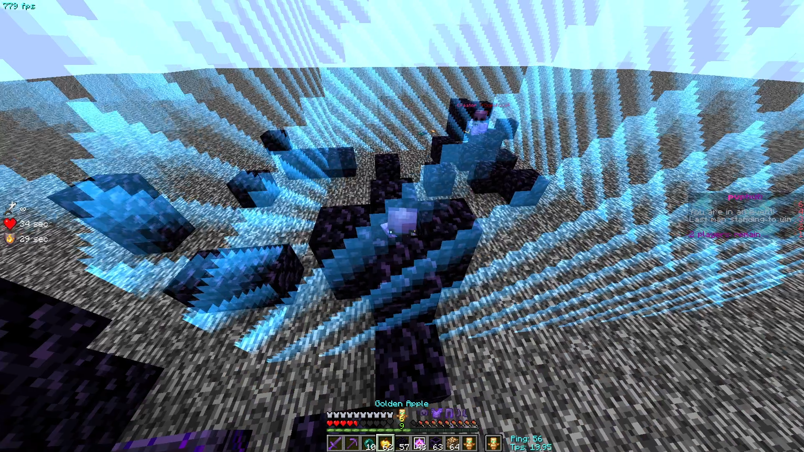

<h1>Uxushud - new customhud mod, which doesnt require any third party mods.</h1>

I didn't plan to publish this mod, but my friends inspired me to do so. This mod has unique features unlike other custom hud mods. 

Report bugs and issues, and they will be fixed. Also, you can give me ideas for new hud elements. Note that im already developing hudeditor gui for my mod.

 

<h2>Why my mod is good?</h2>

For example, mymod has SpectatorCameraClip, which allows your camera to clip in blocks while you're in specator mode. It can be used to clip your friends pov.

## How to edit config?
- You need to launch your game with this mod. After youve launched mc, it creates config file in directory ".minecraft\config\uxushud_config.txt"
- When your game isnt launched, you can customize.
 
<h2>Feedback from my friends</h2>

 

## Build
To build from source, follow these steps:

- Open a terminal and clone the repository using git clone https://github.com/uxokpro1234/Uxushud.
- Go into this directory using cd <location of cloned repo>.
- Run ./gradlew build on linux or macos or gradlew build on windows.
- Get the mod file from the /build/libs folder.
